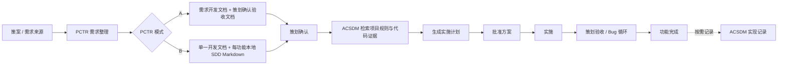

# ACSDM 与 PCTR 快速上手及详细功能说明

> 面向第一次接触本仓库的策划、程序、QA、技术负责人和 AI Agent 使用者。
>
> 本文档说明仓库当前已经实现的能力、正确使用顺序、产物位置、常用命令和限制。
>
> 文档依据：`acsdm-project-catalog` 与 `planning-to-requirements` 当前仓库版本。
>
> 更新日期：2026-07-23。

## 1. 先用一句话理解两个 Skill

| Skill | 解决的问题 | 最主要的产物 |
|---|---|---|
| ACSDM（`acsdm-project-catalog`） | 让 Agent 按索引快速找到项目规则、历史方案、代码位置；现在还可以连接 OUF 开发日志，不再重复保存一份正文。 | `<项目根目录>/.ACSDM/` 项目知识目录 + `08OUFDevelopmentLogs` 连接索引 |
| PCTR（`planning-to-requirements`） | 把策案按功能顺序生成本地工件；只读当前功能的策案内容；Feishu MD 上传改为手动，PCTR只登记链接和状态。 | `<项目根目录>/.PCTR/A/` 或 `.PCTR/<策案版本>/` 需求与状态工件 |

可以把二者理解为：

- PCTR 负责回答“要做什么、策划确认了什么、现在处于什么阶段”。
- ACSDM 负责回答“项目里应该怎么做、已有代码在哪里、历史上做过什么”。
- PCTR 在生成技术方案、分析 Bug、准备实施时，会调用 ACSDM 获取项目证据。
- ACSDM 不替代策案，也不会自行决定策划规则。
- OUF 继续保留自己的完整开发文档；ACSDM/PCTR只登记路径、Hash、摘要和对应功能，减少重复读取。



## 2. 五分钟快速上手

### 2.1 安装整个 Skill 目录

不要只复制 `SKILL.md`。两个 Skill 都依赖自己的 `agents`、`references`、`assets` 和 `scripts`。

个人级安装位置通常是：

```text
C:\Users\<用户名>\.codex\skills\acsdm-project-catalog
C:\Users\<用户名>\.codex\skills\planning-to-requirements
```

项目级安装位置通常是：

```text
<项目根目录>\.codex\skills\acsdm-project-catalog
<项目根目录>\.codex\skills\planning-to-requirements
```

安装完成后重新打开 Codex 任务或开启新任务，让 Skill 列表重新加载。

### 2.2 使用仓库脚本更新

在本仓库根目录执行：

```powershell
# 更新用户级 Skill
powershell -ExecutionPolicy Bypass -File .\Update-UserCodexSkills.ps1

# 更新项目级 Skill
powershell -ExecutionPolicy Bypass -File .\Update-ProjectCodexSkills.ps1
```

更新器会进行快速前进拉取、暂存复制、Skill 静态校验、目录哈希核对和失败回滚。离线时可使用 `-SkipPull`，仅从当前本地仓库提交重新安装。

`Update-AgentNoteSkills.ps1` 是更高级的独立跟踪更新器，可检查上游、本地跟踪分支和已安装目录是否存在漂移。

### 2.3 PJ032 项目中的启用方式

PJ032 使用 `.codex/skill-gates.json` 控制 Skill 套件。命令必须单独成行并完全匹配，普通讨论不会启用 Skill。

```text
启用 ACSDM
禁用 ACSDM

启用 PCTR
启用PCTR-A
启用PCTR-B
禁用 PCTR
```

其中：

- `启用 PCTR` 与 `启用PCTR-A` 都选择 PCTR-A。
- `启用PCTR-B` 选择 PCTR-B。
- ACSDM 与 PCTR 可以同时启用。
- PCTR-A 与 PCTR-B 不能在同一份需求文档中混用。

ACSDM 还提供一个不启用完整 ACSDM 的一次性只读接口：

```text
调用ACSDM的接口，阅读相关文档
```

它只允许完成一次索引式检索，不允许初始化、修复、记录、生成方案或修改项目。

### 2.4 第一次使用建议

如果只是想了解项目：

```text
启用 ACSDM
查阅关卡加载相关文档
```

如果需要把一份策案转换为当前推荐的单文档工作流：

```text
启用PCTR-B
生成 PCTR-B 功能需求开发文档
```

如果需要兼容旧的双文档确认与验收流程：

```text
启用PCTR-A
生成策划确认文档
```

## 3. 产物目录与所有权

不同 Skill 必须使用各自目录，避免相互覆盖。

| 路径 | 所有者 | 用途 |
|---|---|---|
| `<项目根目录>/.ACSDM/` | ACSDM | 项目规则、模块索引、历史方案、实现与审查记录 |
| `<项目根目录>/.PCTR/A/<文档编码>/` | PCTR-A | 需求文档、策划确认验收文档、映射、计划与 Bug 记录 |
| `<项目根目录>/.PCTR/<策案版本>/` | PCTR-B | 单一开发文档、Sidecar、每功能 A-01/A-02/B-01、计划与 Bug 记录 |
| `<项目根目录>/docs/forge-artifacts/` | Orange Unity Forge | Context Brief、SDD、Plan、Report、Evidence 等完整 OUF 产物 |
| `<项目根目录>/docs/` | Orange Unity Forge 保留 | ACSDM 与 PCTR 不得创建新的活动产物，只能登记或链接 |

旧的 `docs/pctr/`、`CodexTemp/PCTR/` 只能作为迁移来源。迁移时应复制到 `.PCTR/`，验证新路径后保留旧文件，除非用户明确要求删除。

# 第一部分：ACSDM

## 4. ACSDM 是什么

ACSDM 是一个项目本地、以 Markdown 为主体的知识目录。它不是在线知识库，也不是只有一个 JSON 指针的索引器。

它的核心目标是：

1. 用根索引快速判断项目有哪些知识模块。
2. 用模块索引找到直接相关的文档、脚本、方法和行号。
3. 只读取当前任务需要的内容，避免全量读取造成上下文浪费。
4. 优先读取项目规则，避免 Agent 按通用经验破坏项目特有框架。
5. 按需记录已经完成的实现、审查、Bug 和验收结果。
6. 为 PCTR 生命周期提供项目规则和代码证据。

## 5. ACSDM 标准目录

初始化后默认包含八个模块：

| 模块 | 主要内容 | 常见触发词 |
|---|---|---|
| `00Rule` | 项目架构、项目规则、自研框架、Lua/C# 交互、UI 框架、导表规范 | 规则、规范、框架、Lua、C#、Excel、弹窗、架构 |
| `01ProjectOverview` | 项目总览、玩法、主要系统、主干脚本、快速导航 | 项目总览、玩法、功能列表、项目概览 |
| `02LevelEditor` | 关卡编辑器、Editor 工具、像素图、难度和生成逻辑 | 关卡编辑器、Editor、像素图、难度 |
| `03LevelLoading` | 关卡、地图、颜色方块、预览图的加载链路 | 关卡加载、地图加载、预览图、加载优化 |
| `04PlayerInput` | 点击、拖拽、填充、手势和输入流程 | 输入、拖拽、DragFill、交互、手势 |
| `05PropSystem` | 道具、解锁、回退、消除错误和道具弹窗 | 道具、回退、道具解锁、道具弹窗 |
| `06Review` | 功能审查、实现审查、风险、验收和检查清单 | 审查、Review、风险、验收 |
| `07ADMD` | 广告、埋点、Analytics、数据上报 | 广告、埋点、打点、统计 |

标准结构：

```text
.ACSDM/
├─ 0000ACSDMRootIndex.md
├─ 00Rule/0000Index.md
├─ 01ProjectOverview/0100Index.md
├─ 02LevelEditor/0200Index.md
├─ 03LevelLoading/0300Index.md
├─ 04PlayerInput/0400Index.md
├─ 05PropSystem/0500Index.md
├─ 06Review/0600Index.md
└─ 07ADMD/0700Index.md
```

项目可以增加扩展模块，也可以为旧目录登记别名，但根索引必须记录兼容映射。

## 6. ACSDM 如何检索

ACSDM 强制采用“索引优先”顺序：

```text
.ACSDM/0000ACSDMRootIndex.md
  -> 匹配模块
  -> 模块 xx00Index.md
  -> 直接相关的 Markdown
  -> 文档明确引用的脚本、方法和行号
```

不应为了“了解项目”而递归读取全部 Markdown。

### 6.1 规则优先

需求涉及以下内容时，应先读取 `00Rule`：

- 项目规范、框架或架构；
- Lua 与 C# 交互；
- UI 框架、弹窗、道具弹窗；
- Excel 导入导出、配置表；
- 全局输入、通用交互和项目特有操作方式。

随后再读取具体功能模块。

### 6.2 模块索引能提供什么

每条文档索引记录包含：

- Markdown 文件名；
- 加入和最后修改时间；
- 文档用途；
- 相关脚本路径；
- 脚本职责；
- 方法或入口；
- 相关行号；
- 检索关键词；
- 记录类型。

因此 Agent 可以在打开正文之前先判断文档是否真正相关。

## 7. 初始化、扫描和索引维护

### 7.1 初始化或修复

用户明确要求初始化后，ACSDM 可以执行：

```powershell
powershell -ExecutionPolicy Bypass -File scripts/acsdm-init.ps1 `
  -ProjectRoot "<项目根目录>"
```

行为包括：

- 创建 `.ACSDM/`；
- 创建八个标准模块；
- 创建根索引和模块索引；
- 已存在的文件默认保留；
- `-Force` 可重建标准索引；
- 如果项目是 Git 仓库，优先把 `.ACSDM/` 写入 `.git/info/exclude`；
- 不会自动修改项目 `.gitignore`。

初始化、修复和创建索引都属于写操作，不能在无关任务中静默执行。

### 7.2 只扫描目录和文件名

```powershell
powershell -ExecutionPolicy Bypass -File scripts/acsdm-scan.ps1 `
  -ProjectRoot "<项目根目录>"
```

加 `-Json` 可以输出机器可读结果。该脚本只扫描模块、文件名、时间和大小，不读取正文。

### 7.3 重新生成索引

```powershell
powershell -ExecutionPolicy Bypass -File scripts/acsdm-update-index.ps1 `
  -ProjectRoot "<项目根目录>"
```

它会根据当前目录和 Markdown 文件重新生成根索引及模块索引。自动生成的用途、脚本和分类字段可能是占位内容，仍需要人工或 Agent 补充。

## 8. ACSDM 的 A/B/C 方案门禁

以下请求通常视为广泛任务：

- 新功能；
- 跨多个文件或模块；
- 模块、规则或实现边界不清楚；
- 有多个互相影响的需求；
- 需要较大范围项目修改。

ACSDM 应先输出：

```markdown
## A. 实现方案

A1. 推荐方案与调用链。

## B. 需要改动的部分

B1. 文件、方法、配置、资源和验证点。

## C. 歧义点与待校准

C1. 风险、冲突和需要确认的决定。
```

在用户发出 `开始实施`、`允许`、`可以执行`、`开始吧`、`按方案做` 等明确授权前，不修改项目文件或 ACSDM 文档。

小而明确的读取、定位或单点修改任务可以直接处理。

## 9. ACSDM 记录机制

### 9.1 `开始实施`

表示允许按已批准方案修改项目，但不会自动写 ACSDM 记录。

### 9.2 `开始实施并记录`

表示修改项目后还要：

1. 更新最相关的现有 ACSDM 文档；
2. 如果没有相关文档，创建下一个两位序号的 Markdown；
3. 更新模块索引；
4. 必要时更新根索引。

记录应包含：

- 需求摘要和最终 A/B/C 决策；
- 修改的文件、方法和行号；
- 相关配置、资源和脚本；
- 验证命令及结果；
- 风险与回滚方式；
- 时间；
- PCTR Feature ID、确认 Revision、计划、验收和 Bug 信息（适用时）。

### 9.3 文档命名

```text
<模块编号><文档编号><文档主题>.md
```

示例：

```text
0201EditorTool01.md
0302LevelPreviewLoading.md
```

`xx00Index.md` 永远是模块索引，新内容从 `xx01` 开始递增。

## 10. ACSDM 一次性只读接口

精确命令：

```text
调用ACSDM的接口，阅读相关文档
```

适用于其他主 Skill 只想读取项目证据，但不希望启用完整 ACSDM 的情况。

允许：

- 读取根索引；
- 根据当前主题匹配模块；
- 必要时读取 `00Rule`；
- 读取相关模块索引和直接相关文档；
- 查看文档明确引用的代码位置。

禁止：

- 初始化或修复 `.ACSDM`；
- 运行 ACSDM 脚本；
- 修改项目或目录；
- 生成 A/B/C、SDD、实施计划；
- 操作 PCTR 生命周期；
- 记录实现或验收结果。

接口在一次响应后自动关闭。

## 11. ACSDM 当前脚本

| 脚本 | 用途 |
|---|---|
| `scripts/acsdm-init.ps1` | 初始化或修复标准 `.ACSDM` 结构 |
| `scripts/acsdm-scan.ps1` | 只扫描模块与 Markdown 文件名，可输出 JSON |
| `scripts/acsdm-update-index.ps1` | 根据当前目录重新生成根索引和模块索引 |

## 12. ACSDM 使用示例

### 12.1 查项目规则

```text
启用 ACSDM
按照项目规范实现一个道具弹窗，先查阅相关文档
```

预期行为：先读根索引和 `00Rule`，再读 `05PropSystem`，只打开相关文档和代码位置。

### 12.2 只定位代码

```text
启用 ACSDM
查阅关卡加载相关文档，告诉我主要加载入口和行号，不修改代码
```

### 12.3 实施并留下记录

```text
开始实施并记录
```

预期行为：按已批准方案实施，并更新相关 ACSDM 文档与索引。

# 第二部分：PCTR

## 13. PCTR 是什么

PCTR 管理从策案到功能完成的整个链路：

```text
策案读取
  -> 功能识别与编码
  -> 需求开发文档
  -> 策划确认
  -> 技术路线与实施计划
  -> 方案批准
  -> 实施
  -> 策划验收
  -> Bug 修复与重新验收
  -> 功能完成
```

PCTR 的核心约束是：Agent 不能自行决定策划歧义，也不能在确认和方案批准之前直接实施。

## 14. PCTR-A 与 PCTR-B 如何选择

| 对比项 | PCTR-A | PCTR-B |
|---|---|---|
| 启用命令 | `启用 PCTR` 或 `启用PCTR-A` | `启用PCTR-B` |
| 人类文档数量 | 两份 | 一份 |
| 功能拆分 | 原子功能拆分 | 保持策案标题边界 |
| 策划确认载体 | 独立的策划确认与验收文档 | 功能章节内的本地 SDD Markdown 附件与确认框 |
| 功能编码 | 稳定原子 Feature ID | `<策案层级序号>-<原功能编码>` |
| 适用场景 | 需要逐原子功能确认、验收和多轮记录的旧流程 | 希望飞书文档简洁、功能数量多、SDD 以本地附件交接的流程 |
| 飞书 SDD | 可按 A 模式规格生成 | 禁止每个功能创建独立飞书 SDD 文档 |
| 本地状态 | 双文档映射和状态 | 单文档 + JSON Sidecar |

不要在现有文档中直接把 A 改成 B 或把 B 改成 A。需要迁移时应生成新文档，并保留旧文档作为已被替代的历史来源。

## 15. PCTR 共通功能

### 15.1 策案读取与来源追踪

PCTR 会记录：

- 策案 URL、token、文档 ID 和 Revision；
- 标题层级与顺序；
- 表格、列表、媒体、删除标记和占位内容；
- 功能与来源标题路径；
- 来源指纹；
- 已确认、推断和未确认信息。

策案示例、占位符和不完整描述不能自动当作最终规则。

### 15.2 ACSDM 与代码证据

当项目可用时，PCTR 会按以下顺序取证：

1. `.ACSDM/0000ACSDMRootIndex.md`；
2. 涉及规则时先读 `00Rule`；
3. 匹配模块索引；
4. 直接相关文档；
5. 文档引用的代码位置。

输出中必须区分：

- `策划明确要求`；
- `策划最终确认`；
- `ACSDM 项目规则`；
- `代码现状`；
- `建议方案`；
- `待确认`。

### 15.3 复杂度路由

PCTR 会根据模块跨度、数据影响、状态复杂度、共享影响、外部依赖、歧义和回归范围评分。

| 分数 | 默认路线 |
|---:|---|
| 0–3 | 标准 A/B/C |
| 4–6 | 增强 A/B/C |
| 7–14 | SDD |

以下情况直接进入 SDD：

- 存档结构、迁移或旧数据修复；
- 公共框架或基础服务变更；
- 三个以上模块；
- 复杂状态机或多个异步序列；
- 广告、支付、账号、隐私、网络协议、平台 SDK；
- 全局操作锁、弹窗队列或广泛动画并发；
- 核心行为存在高成本歧义；
- 预计修改五个以上核心脚本；
- 必须设计兼容、发布或回滚。

复杂度预路由不代表正式方案已经获批。策划确认改变范围后必须重新计算。

### 15.4 生命周期状态

PCTR 将不同阶段分开管理：

| 状态字段 | 说明 |
|---|---|
| `planning_confirmation_status` | PCTR-A 策划确认状态 |
| `sdd_confirmation_status` | PCTR-B SDD 确认状态 |
| `technical_plan_status` | 技术方案是否创建、待批准或已批准 |
| `development_status` | 未开始、实施中、联调中、待验收、修 Bug、已完成 |
| `planning_acceptance_status` | 未进入、验收中、部分通过、失败、已接受 |
| `final_feature_status` | 未开始、处理中、阻塞、完成、移出范围、已替代 |

关键门禁：

- 未确认需求不能生成正式实施计划；
- 技术方案未批准不能实施；
- 代码完成不等于策划验收；
- 部分验收或失败不能标记完成；
- 只有显式完成命令才能进入最终完成状态。

## 16. PCTR-A 详细功能

### 16.1 产物

默认路径：

```text
<项目根目录>/.PCTR/A/<文档编码>/
```

主要包含：

1. 功能需求开发文档；
2. 策划确认与验收文档；
3. 功能映射或状态文件；
4. 实施计划；
5. Bug 记录。

### 16.2 原子功能拆分

PCTR-A 会把策案拆成可以单独规划、实施、测试和验收的原子功能。

常见独立项包括：

- 数据结构和默认值；
- 数据加载与旧数据兼容；
- UI 入口与可见性；
- 弹窗内容与跳转；
- 输入锁与操作屏蔽；
- 动画触发和结束；
- 多语言；
- 存档和重置边界；
- 广告、埋点与平台映射；
- 音频、震动和美术资源；
- 异常和冲突处理。

拆分不会把一个很小的文本或样式修改人为拆成大量任务。

### 16.3 功能需求开发文档

每个功能包含：

- ID、来源、目标、范围和非范围；
- 前置条件、主流程和分支；
- 状态、生命周期、数据和兼容；
- UI、依赖、冲突和异常；
- ACSDM 证据；
- 技术验收和测试矩阵；
- 待确认问题；
- 策划确认同步结果；
- 技术路线和方案状态；
- 实施、验收、Bug 和最终状态；
- 带确认门禁的可复制 Agent 任务。

### 16.4 策划确认与验收文档

这份文档面向策划，包含：

- 不依赖代码知识的功能简述；
- 玩家或产品可见范围；
- 稳定确认 ID：`PC-<FEATURE-ID>-<NN>`；
- 阻塞/非阻塞问题；
- 策划答复和最终摘要；
- 稳定验收 ID：`PA-<FEATURE-ID>-<NN>`；
- 验收轮次、失败项、Bug 和重新提交记录。

策划填写的答复、验收结果和备注属于人工权威字段，同步时不能被生成内容覆盖。

### 16.5 策划确认

只有当所有阻塞项已经解决，并收到显式同步命令时，才能设置为 `confirmed`。

同步会：

- 把策划最终结论写回需求文档；
- 保留原始策案和冲突记录；
- 更新范围与验收标准；
- 重新计算复杂度路线；
- 解锁实施计划生成。

### 16.6 验收与 Bug 循环

提交策划验收后，每次验收形成一个独立轮次。失败时：

1. 保留失败轮次；
2. 记录失败验收 ID；
3. 创建 `BUG-<FEATURE-ID>-<NN>`；
4. 进入 Bug 修复状态；
5. 读取已确认需求、ACSDM、实现证据、日志和代码；
6. 先给首次分析，再等待修复授权；
7. 修复后创建新的验收轮次。

旧轮次不能被覆盖。

## 17. PCTR-B 详细功能

PCTR-B 是当前更适合“一个策案包含大量功能”的单文档流程。

### 17.1 产物

```text
<项目根目录>/.PCTR/B/<文档编码>/
├─ <功能需求开发文档>.md
├─ <功能状态>.json
├─ plans/
└─ bugs/
```

Orange 生成的角色分区 SDD 通常位于：

```text
<项目根目录>/CodexTemp/OrangeUnityForge/specs/
```

PCTR-B 只在飞书创建一份“SDD 工件开发文档”，不会为几十个功能创建几十份独立飞书 SDD 文档。

### 17.2 功能边界

PCTR-B 保持策案标题结构：

1. 有子标题的标题是分组；
2. 叶子/小标题是一个功能；
3. 没有子标题的大标题本身是一个功能；
4. 不把一个策案标题拆成多个可见功能章节；
5. 真正空标题可以忽略，但必须确认其中没有正文、表格、列表、媒体或子内容。

### 17.3 功能编码

格式：

```text
<策案层级序号>-<原功能编码>
```

例如：

```text
1.1-XK5A-SAVE-F003
5-XK5A-SAVE-F001
```

Sidecar 同时保存：

- `planning_sequence`：策案层级序号；
- `base_feature_id`：原功能编码；
- `legacy_feature_ids`：历史完整编码和原编码。

策案调整顺序后，可以修改显示的序号前缀，但不能把原编码重新分配给另一个功能。

### 17.4 功能总表

总表必须严格使用五列：

| 功能编码 | 策案标题 | 策案标题路径 | 功能需求说明 | 工时 |
|---|---|---|---|---|

要求：

- `功能需求说明` 是简短、基于策案的摘要；
- 不包含图片、媒体 URL、HTML/XML、Markdown 表格或大段策案原文；
- `工时` 默认留空，等待人工填写；
- 不添加策案进度、确认状态、开发状态、验收状态等生命周期列。

### 17.5 功能章节格式

每个功能必须按来源顺序包含五部分：

```text
1. 功能需求说明
2. SDD确认文档
3. 实施计划工件的路径
4. 功能 Bug 修复记录文件路径
5. 优化建议
```

未进入设计或开发的功能：

- `1. 功能需求说明` 保持为空；
- 只保留标题和固定结构。

当前正在设计或开发的功能：

- 写一段简短功能描述；
- 写少量“主要功能点”；
- 不粘贴策案原文、表格、图片、媒体链接、引用标记或飞书 XML/HTML；
- ACSDM 和代码建议放在 `5. 优化建议` 或 SDD 中。

### 17.6 SDD Markdown 附件

每个功能可以关联一份本地角色分区 SDD Markdown。

功能章节中记录：

- 本地 `.md` 路径；
- 附件名、token 或 URL；
- 所在飞书开发文档 Revision；
- SDD 状态与版本；
- 两个互斥确认框。

```text
[ ] 已确认
[ ] 存在歧义需要修改
```

规则：

- 上传附件不等于策划确认；
- Draft 或 In Review 可以上传，但仍锁定计划生成；
- 两个确认框不能同时选择；
- 自动插入必须能够准确定位功能章节并验证结果；
- 如果 IDE/CLI 不能保证位置和高亮块格式，应停止自动写入，由用户手动上传；
- 手动上传后使用登记命令补充附件身份；
- 不得把 SDD 导入成每功能一个独立飞书 Docx。

### 17.7 Sidecar 状态文件

Sidecar 是机器状态，不上传到飞书。当前 schema 为 `2`，主要保存：

- 来源 URL 与 Revision；
- 开发文档 URL、Revision 和本地路径；
- 完整/原始/历史 Feature ID；
- 策案标题路径与来源指纹；
- 总表摘要和当前功能需求描述；
- 本地 SDD 路径；
- 附件名、token、URL 和所在文档 Revision；
- SDD 状态、版本与确认状态；
- 实施计划路径；
- Bug 记录路径；
- 最后同步时间。

Sidecar 顺序必须和开发文档中的功能顺序一致。

### 17.8 与 Orange Unity Forge 的集成

推荐顺序：

1. PCTR-B 先生成并注册开发文档与 Sidecar；
2. Orange 使用策案 URL、Revision 和精确标题路径查询功能身份；
3. PCTR-B 返回唯一 Feature ID 回执；
4. Orange 按回执生成 Context Brief 和角色分区 Draft SDD；
5. SDD 元数据写入完整 Feature ID、原编码、策案序号、标题路径、来源 Revision 和开发文档；
6. 静态验证通过后尝试把本地 `.md` 附件放进对应功能章节；
7. 无法可靠定位时转为人工上传；
8. 上传后确认状态仍为 `pending`。

禁止按标题模糊猜测 Feature ID。来源 Revision、标题路径或指纹冲突时必须停止。

### 17.9 SDD 确认与实施计划

`<FEATURE-ID> SDD已确认` 要求：

- 本地 SDD 路径有效；
- 功能章节中存在匹配附件；
- 已记录所在开发文档 Revision；
- SDD 状态为 `Approved`；
- 没有阻塞待确认项。

确认后，`开始 <FEATURE-ID> 功能开发` 只生成独立的本地实施计划，不生成第二份 SDD，也不直接改代码。

计划生成后必须再执行：

```text
批准 <FEATURE-ID> 技术方案
开始实施 <FEATURE-ID>
```

### 17.10 更新策案

策案更新时 PCTR-B 会：

- 比较 Revision 和标题指纹；
- 保持标题文本和顺序；
- 保留原编码与历史别名；
- 新增功能使用新的原编码；
- 策案顺序变化时更新序号前缀；
- 保留 SDD 附件、确认、计划、Bug、工时和人工编辑；
- 删除的功能先标记待确认移除；
- 同一字段发生并发修改时输出冲突，不直接覆盖。

### 17.11 当前已知限制

以下是当前仓库的真实边界，不应当作已经实现的能力：

- Sidecar 当前记录 SDD 路径、附件身份和文档 Revision，但尚未保存每次上传的不可变本地 SDD 快照。
- 当前没有完整的“飞书 SDD 版本历史拉取 → 本地语义差异 → 自动调整点报告”闭环。
- 如果手动上传后没有登记附件 token 或 URL，PCTR 无法自动重新获取该 Markdown。
- `sync_pctr_b_sdd.py` 要求附件 token 或 URL、开发文档 Revision、SDD 状态和版本。
- 自动附件插入依赖飞书工具能否精确定位并验证；不可靠时必须人工上传。
- 实施计划默认只保存本地路径，不会自动上传飞书。

## 18. PCTR 命令速查

| 命令 | 作用 | 是否改代码 |
|---|---|---:|
| `生成策划确认文档` | PCTR-A 创建策划确认与验收文档 | 否 |
| `生成 PCTR-B 功能需求开发文档` | 创建 PCTR-B 本地文档、Sidecar 和单一飞书开发文档 | 只写文档 |
| `同步PCTR-B SDD <FEATURE-ID>` | 校验并尝试把本地 Markdown 附件放入对应功能章节 | 只写文档 |
| `登记PCTR-B Markdown附件 <FEATURE-ID>` | 登记自动或人工上传的附件和所在文档 Revision | 否 |
| `<FEATURE-ID> SDD已确认` | 确认 PCTR-B SDD 并解锁计划 | 否 |
| `<FEATURE-ID> SDD存在歧义需要修改` | 退回 SDD 修改并保持锁定 | 否 |
| `同步策划确认 <FEATURE-ID>` | PCTR-A 校验并同步策划结论 | 否 |
| `<FEATURE-ID> 策划已确认` | 同步并确认 PCTR-A 功能 | 否 |
| `开始 <FEATURE-ID> 功能开发` | 生成对应路线的详细实施计划 | 否 |
| `批准 <FEATURE-ID> 技术方案` | 批准已经生成并校验的计划 | 否 |
| `开始实施 <FEATURE-ID>` | 按批准计划修改代码 | 是 |
| `开始实施并记录 <FEATURE-ID>` | 实施并更新/创建 ACSDM 记录 | 是 |
| `提交 <FEATURE-ID> 策划验收` | 创建下一轮策划验收 | 否 |
| `<FEATURE-ID> 验收失败存在Bug：<描述>` | 记录失败并生成首次分析 | 否 |
| `开始修复 <FEATURE-ID> <BUG-ID>` | 按批准的 Bug 修复方案修改代码 | 是 |
| `<FEATURE-ID> 重新提交策划验收` | 保留旧轮次并追加新轮次 | 否 |
| `<FEATURE-ID> 策划已验收（任务完毕）` | 校验并标记功能完成 | 否 |
| `<FEATURE-ID> 策划已验收（任务完毕）并记录` | 完成并更新 ACSDM 记录 | 只写 ACSDM |

普通讨论、飞书勾选或手动改文档不能自动等同于上述状态命令。同步前必须校验当前 Revision 和状态。

## 19. 一次完整的 PCTR-B 使用示例

### 第一步：启用并生成开发文档

```text
启用PCTR-B
根据这份飞书策案生成 PCTR-B 功能需求开发文档：<策案链接>
```

预期结果：

- 完整读取策案标题树；
- 生成功能总表；
- 使用序号前缀 Feature ID；
- 未开发功能只保留固定标题结构；
- 创建 `.PCTR/B/<文档编码>/` 文档和 Sidecar；
- 创建或登记一份飞书开发文档。

### 第二步：为一个功能生成 SDD

在 Orange 已启用且身份查询成功后：

```text
为 1.2.1-XK5A-SAVE-F004 生成角色分区 SDD
```

预期结果：

- 先通过 PCTR-B 查询精确功能身份；
- 生成本地 Context Brief 和 SDD；
- 不生成实施计划；
- 不修改代码；
- 尝试把 `.md` 附件放入对应飞书章节，失败则给出人工上传位置。

### 第三步：登记与确认

```text
登记PCTR-B Markdown附件 1.2.1-XK5A-SAVE-F004
1.2.1-XK5A-SAVE-F004 SDD已确认
```

如果策划认为存在歧义：

```text
1.2.1-XK5A-SAVE-F004 SDD存在歧义需要修改
```

### 第四步：生成并批准实施计划

```text
开始 1.2.1-XK5A-SAVE-F004 功能开发
批准 1.2.1-XK5A-SAVE-F004 技术方案
```

第一条只生成计划，第二条只批准计划，均不会修改代码。

### 第五步：实施与验收

```text
开始实施 1.2.1-XK5A-SAVE-F004
提交 1.2.1-XK5A-SAVE-F004 策划验收
```

验收失败：

```text
1.2.1-XK5A-SAVE-F004 验收失败存在Bug：冰块解锁后数字仍不可点击
```

修复和重新提交：

```text
开始修复 1.2.1-XK5A-SAVE-F004 BUG-1.2.1-XK5A-SAVE-F004-01
1.2.1-XK5A-SAVE-F004 重新提交策划验收
```

最终完成：

```text
1.2.1-XK5A-SAVE-F004 策划已验收（任务完毕）并记录
```

## 20. 一次完整的 PCTR-A 使用示例

```text
启用PCTR-A
根据这份策案生成功能需求开发文档：<策案链接>
生成策划确认文档
```

策划完成答复后：

```text
同步策划确认 FEATURE-ID
开始 FEATURE-ID 功能开发
批准 FEATURE-ID 技术方案
开始实施 FEATURE-ID
提交 FEATURE-ID 策划验收
```

PCTR-A 的关键是两份文档必须保持 Feature ID、Revision、确认和验收状态一致。

## 21. ACSDM 与 PCTR 如何协同

| 阶段 | PCTR 职责 | ACSDM 职责 |
|---|---|---|
| 策案读取 | 提取来源事实、功能和歧义 | 不决定策案内容 |
| 策划确认 | 管理确认项、确认 Revision 和最终结论 | 提供项目规则作为影响说明 |
| 技术计划 | 选择 ABC/增强 ABC/SDD，管理计划状态 | 检索规则、历史方案、代码路径和实现证据 |
| 实施 | 管理批准和实施门禁 | 约束项目实现方式，按需记录改动 |
| 验收失败 | 保存验收轮次、Bug 和策划描述 | 查历史实现、规则、代码并支持根因分析 |
| 完成 | 校验状态并标记完成 | 仅在用户要求“并记录”时更新知识目录 |

PCTR Feature ID 是两个 Skill 之间最重要的关联键。ACSDM 记录 PCTR 功能时，应同时记录：

- PCTR 模式；
- Feature ID；
- 已确认需求或 SDD Revision；
- 确认来源；
- 路线和批准计划；
- 改动文件、方法和行号；
- 验证证据；
- 验收轮次和 Bug；
- 回滚与最终结果。

## 22. PCTR 当前脚本

| 脚本 | 模式 | 用途 |
|---|---|---|
| `build_pctr_b_document.py` | B | 从规范化 Markdown 生成单一开发文档和 Sidecar，分配序号前缀 ID |
| `register_pctr_b_feishu_document.py` | B | 登记飞书开发文档 URL、Revision 和同步时间 |
| `sync_pctr_b_sdd.py` | B | 登记本地 SDD、附件身份、状态、版本、确认状态和开发文档 Revision |
| `validate_pctr_b_document.py` | B | 校验五列表格、Feature ID、五段结构、高亮块、Bug 表和需求文本 |
| `validate_pctr_b_state.py` | B | 校验开发文档与 Sidecar 的顺序、ID、描述指纹和确认状态 |
| `build_planning_confirmation.py` | A | 从需求文档生成策划确认与验收文档 |
| `sync_planning_confirmation.py` | A | 把已确认策划结论同步回需求文档 |
| `validate_feature_document.py` | A | 校验需求开发文档结构和原子功能 |
| `validate_planning_confirmation.py` | A | 校验策划确认与验收文档 |
| `validate_dual_document_state.py` | A | 校验双文档 Feature ID 和确认状态一致性 |
| `score_complexity.py` | A/B | 根据输入 JSON 计算复杂度和路线 |
| `transition_feature_state.py` | A/B | 应用受控的功能状态迁移 |

## 23. PCTR 当前模板

| 模板 | 用途 |
|---|---|
| `detailed-feature-document-template.md` | PCTR-A 详细需求功能章节 |
| `planning-confirmation-document-template.md` | PCTR-A 策划确认与验收总文档 |
| `planning-confirmation-feature-template.md` | PCTR-A 单功能确认与验收章节 |
| `planning-acceptance-bug-template.md` | 策划验收失败后的首次 Bug 分析 |
| `pctr-b-development-document-template.md` | PCTR-B 单一开发文档 |
| `pctr-b-feature-template.md` | PCTR-B 单功能固定五段结构 |
| `pctr-b-state.example.json` | PCTR-B Sidecar schema 示例 |
| `pctr-b-orange-sdd-request-template.md` | PCTR-B 向 Orange 发起 SDD 生成交接 |
| `agent-task-abc-template.md` | 标准 A/B/C Agent 任务 |
| `agent-task-enhanced-abc-template.md` | 增强 A/B/C Agent 任务 |
| `agent-task-sdd-template.md` | PCTR-A SDD 路线任务模板 |

## 24. 常见问题与排错

### 24.1 Agent 找不到 ACSDM

检查：

```text
<项目根目录>/.ACSDM/0000ACSDMRootIndex.md
```

如果 `.ACSDM` 不存在，必须由用户明确要求初始化。根索引缺失时先报告，不应静默重建。

### 24.2 Agent 读取了大量无关文档

正确行为是根索引 → 模块索引 → 相关文档。除非用户要求完整审计，否则不应递归读取全部 Markdown。

### 24.3 PCTR 模式不明确

检查 `.codex/skill-gates.json`：

- `pctr=true`；
- `pctr_mode` 必须是 `A` 或 `B`。

缺失或非法模式必须停止，不能根据文档长相猜测。

### 24.4 PCTR-B 生成了几十份飞书 SDD

这是错误行为。PCTR-B 只创建一份飞书开发文档，每个功能的 SDD 是放在对应章节里的本地 `.md` 附件。

### 24.5 PCTR-B 未开发功能出现大量策案原文

这是错误行为。未开发功能的 `1. 功能需求说明` 应为空；总表只写简要说明；当前功能只写功能描述和主要功能点。

### 24.6 无法自动把 SDD 放到正确飞书位置

停止自动写入，返回：

- 本地 Markdown 路径；
- 精确 Feature ID；
- 精确功能标题；
- 目标飞书开发文档；
- 应插入的功能章节。

用户手动上传后，再登记附件身份和开发文档 Revision。

### 24.7 计划未确认就要求实施

PCTR 必须拒绝。合法顺序是：

```text
策划/SDD确认
  -> 开始功能开发（生成计划）
  -> 批准技术方案
  -> 开始实施
```

### 24.8 验收失败后历史记录消失

这是错误行为。每次重新提交都必须追加新轮次，旧失败轮次和 Bug ID 永远保留。

### 24.9 产物写进了 `docs/`

这是错误路径：

- ACSDM 使用 `.ACSDM/`；
- PCTR 使用 `.PCTR/`；
- Orange 工作工件使用 `CodexTemp/OrangeUnityForge/`；
- `docs/` 保留给 Orange 的项目级用途。

## 25. 推荐使用习惯

1. 先确认 Skill 门禁和 PCTR 模式。
2. 先确认策案 URL、Revision、标题路径和文档编码。
3. 规则类需求先读 ACSDM `00Rule`。
4. PCTR-B 必须先生成并注册开发文档，再生成 SDD。
5. Feature ID 必须来自 PCTR，不按标题或文件名猜测。
6. 上传 SDD 后仍保持 `pending`，等待策划明确确认。
7. “开始功能开发”只生成计划，不直接写代码。
8. 计划必须经过“批准技术方案”。
9. 验收失败先分析，修复需要单独授权。
10. 只有用户明确要求“并记录”时才更新 ACSDM 实现记录。
11. 保留来源 Revision、附件身份、验收轮次和 Bug 历史。
12. 不把当前尚未实现的优化能力写成已完成能力。

## 26. 维护者入口

如果需要调整 Skill 行为：

### ACSDM

- 触发与总规则：`acsdm-project-catalog/SKILL.md`
- 模块匹配：`references/retrieval-policy.md`
- 目录和索引：`references/index-schema.md`
- 新文档格式：`references/document-template.md`
- 文件系统操作：`scripts/acsdm-*.ps1`

### PCTR

- 入口和生命周期：`planning-to-requirements/SKILL.md`
- 模式选择：`references/mode-routing.md`
- PCTR-A：`references/workflow.md`、`output-schema.md`
- PCTR-B：`references/pctr-b-workflow.md`、`pctr-b-output-schema.md`
- 状态与命令：`feature-lifecycle.md`、`command-contract.md`
- ACSDM 集成：`acsdm-integration.md`
- Orange 集成：`pctr-b-feature-lookup-interface.md`、`pctr-b-handoff-interface.md`
- 模板：`assets/`
- 生成、同步和校验：`scripts/`

修改 Skill 后，应使用 Codex Skill 静态校验器检查两个完整目录，并在新任务中用本文档的快速上手示例进行人工流程核对。


## 18. 本次优化后的省时链路

这次优化不是减少必要文档，而是减少重复读取和重复保存。

### 18.1 ACSDM 连接 OUF，不复制 OUF

- OUF 仍然把完整开发日志、SDD、Plan、Report、Evidence 放在 `docs/forge-artifacts/`。
- ACSDM 新增 `.ACSDM/08OUFDevelopmentLogs/0800Index.md`，只保存 Feature ID、标题、类型、路径、摘要、更新时间和 Hash。
- Agent 需要了解历史开发链路时，先读这个索引，再打开对应 OUF 原文件。
- 好处：不用 OUF 保存一份、ACSDM 再保存一份，也不用每次全量扫描。

刷新索引：

```powershell
powershell -ExecutionPolicy Bypass -File acsdm-project-catalog/scripts/acsdm-link-ouf.ps1 -ProjectRoot <项目根目录>
```

### 18.2 PCTR 只处理当前功能的飞书内容

PCTR-B sidecar 每个功能新增 `feishu_blocks`：

```json
{
  "planning_heading_block_id": "",
  "planning_content_block_ids": [],
  "development_feature_heading_block_id": "",
  "development_sdd_heading_block_id": "",
  "last_planning_revision_checked": -1,
  "last_development_revision_checked": -1
}
```

有这些定位后，生成或更新某个功能时只读该功能章节，不反复读取整份策案。

### 18.3 Feishu MD 上传改为手动，PCTR 只登记

- PCTR 生成本地 `A-01`、`A-02`，需要时生成或接收 `B-01`。
- PCTR 告诉用户应该上传到哪个功能、哪个 `2. SDD确认文档` 标题下。
- 用户/程序手动拖动上传 MD。
- 上传后用登记命令写入附件 token/URL/revision。

这样避免 Agent 为了移动/覆盖飞书附件消耗大量时间和 token。

### 18.4 A-02 是唯一上下文包

`A-02-feature-decomposition.md` 保留为当前功能唯一的策案上下文包，里面放：来源快照、功能拆解、策划确认结果、ACSDM/OUF 证据索引。OUF 读它来生成开发工件；程序也读它来确认实现边界。
